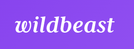
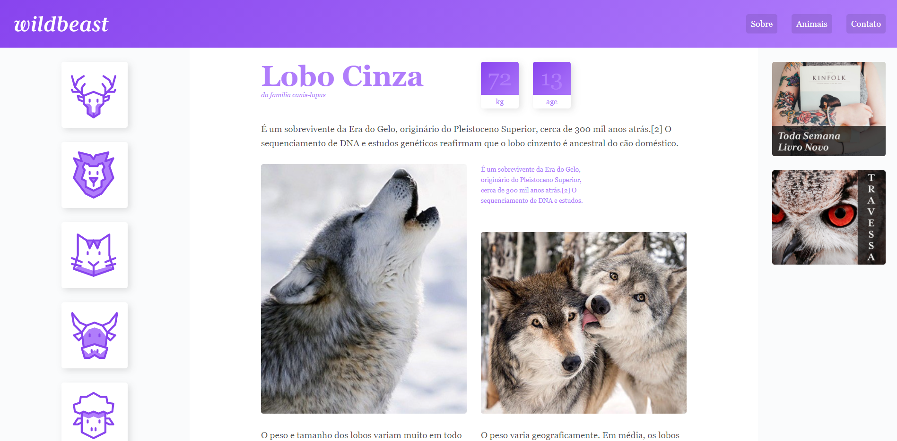
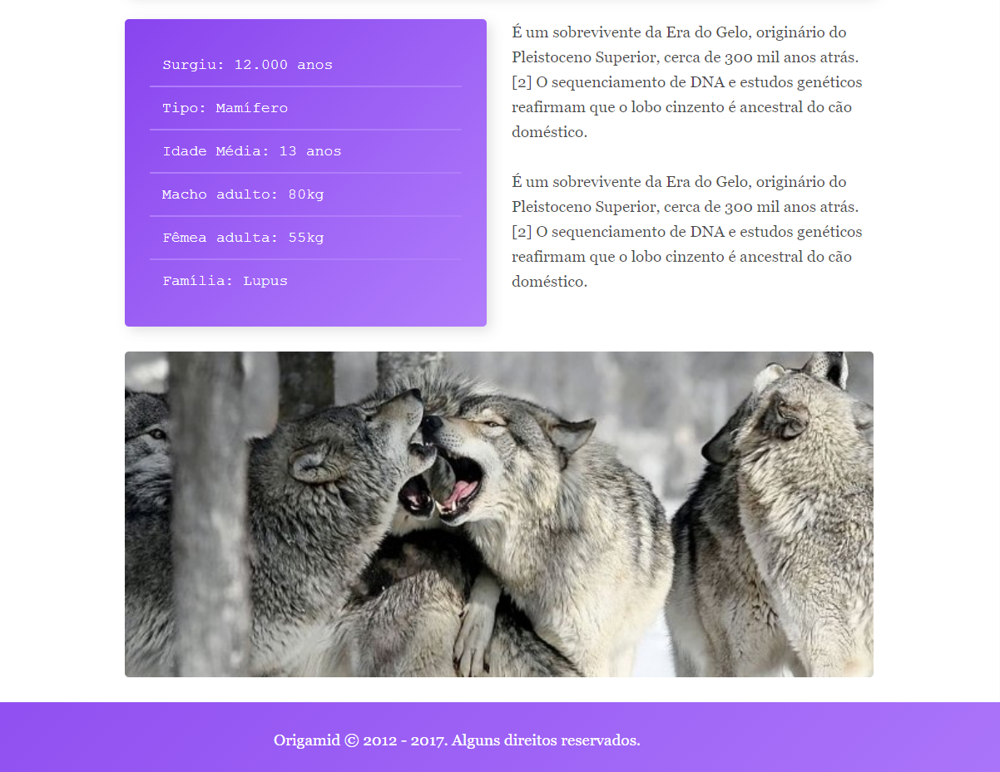
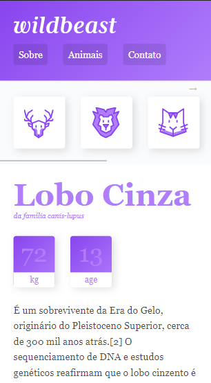
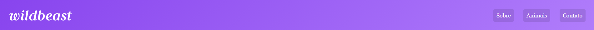

  
  
Um site criado em estudo da Origamid

<h1 align=center>Um site responsivo, utilizando tantos as propriedades Grid Layout e as propriedades Flexbox</h1>

É um site falando sobre lobo. O por quê do lobo?

Quando você ver um lobo na sua frente, você no mínimo demonstrará respeito.

  <h2>Versão Desktop</h2>
  
  
  <h2>Versão Mobile</h2>
  

A Navbar do site é feita de forma simples, mas bem elegante.

